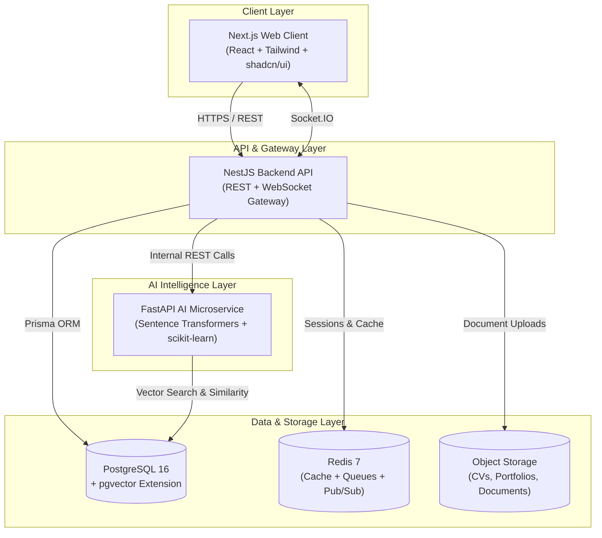
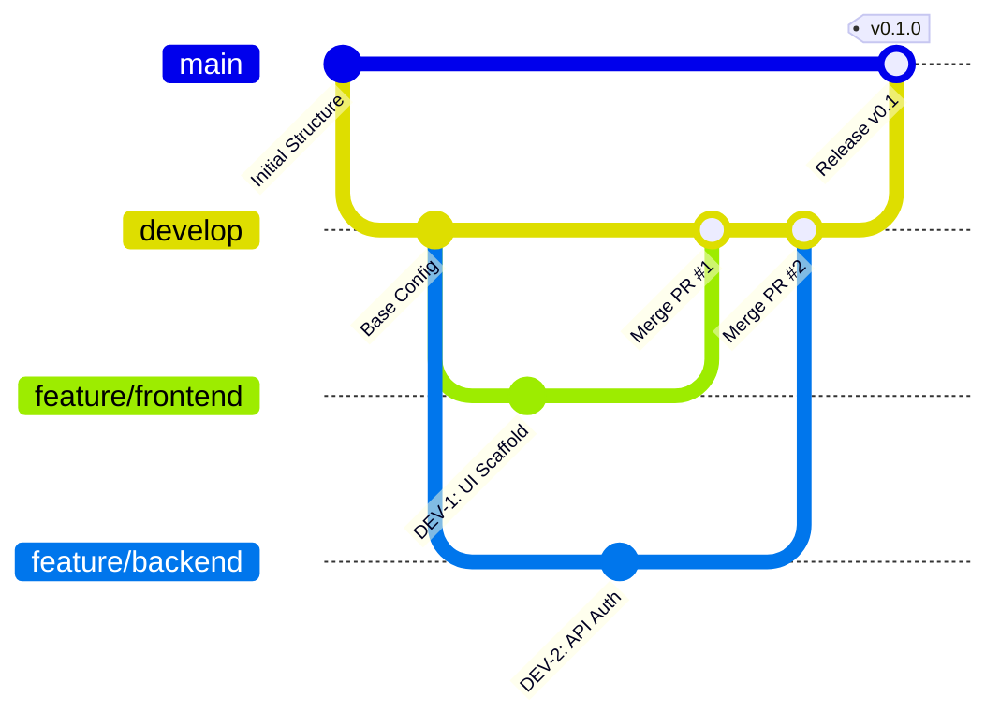

# Ethiopian Upwork

> **AI-Powered Integrated Employment, Freelancing & Local Service Marketplace**  
> An enterprise-grade, multi-tenant marketplace platform connecting employers, job seekers, freelance clients, and local service providers with explainable AI-driven semantic matching.

---

[](#system-architecture)
[](frontend/)
[](backend/)
[](ai-service/)
[](database/)
[](docker/)
[](.github/workflows/)

---

## 📑 Table of Contents

- [System Architecture](#-system-architecture)
- [Remote Team Ownership](#-remote-team-ownership)
- [Project Directory Structure](#-project-directory-structure)
  - [Root Layout](#root-layout)
  - [Frontend Service (`frontend/`)](#1-frontend-service-frontend)
  - [Backend Service (`backend/`)](#2-backend-service-backend)
  - [AI & Recommendation Service (`ai-service/`)](#3-ai--recommendation-service-ai-service)
  - [Database, Docker & Testing](#4-infrastructure-database--testing)
- [Branching & Collaboration Strategy](#-branching--collaboration-strategy)
- [Local Development Setup](#-local-development-setup)
- [Architecture & Planning Documents](#-architecture--planning-documents)

---

## 🏛 System Architecture

The platform uses a decoupled modular full-stack architecture with a dedicated AI microservice for semantic matching, vector similarity, and explainable recommendations.



---

## 👥 Remote Team Ownership

The engineering team consists of **4 remote developers**, each owning an isolated architectural boundary to prevent merge conflicts and ensure independent velocity:

| Developer | Domain Role | Tech Stack | Assigned Feature Branch |
| :--- | :--- | :--- | :--- |
| **DEV-1** | **Frontend & UX** | Next.js 14, React, TypeScript, Tailwind CSS, shadcn/ui, Zod | `feature/frontend/*` |
| **DEV-2** | **Backend & Database** | NestJS, TypeScript, Prisma ORM, PostgreSQL, Socket.IO, JWT | `feature/backend/*` |
| **DEV-3** | **AI / ML & Recommendations** | Python, FastAPI, Sentence Transformers, scikit-learn, pgvector | `feature/ai/*` |
| **DEV-4** | **DevOps, Security & QA** | Docker Compose, GitHub Actions, Nginx, Playwright, Jest, Pytest | `feature/devops/*` |

---

## 📁 Project Directory Structure

### Root Layout

```text
Ethiopian-Upwork/
│
├── .github/                      # GitHub workflows, actions, and issue/PR templates
├── ai-service/                   # Python FastAPI AI, NLP & recommendation service
├── backend/                      # NestJS modular backend REST API & WebSockets
├── database/                     # PostgreSQL initialization scripts, migrations & seeds
├── docker/                       # Service Dockerfiles and reverse proxy configurations
├── docs/                         # System architecture, API documentation & setup guides
├── frontend/                     # Next.js 14 frontend web application
├── tests/                        # Cross-service integration and end-to-end tests
│
├── .editorconfig                 # Shared team code formatting rules
├── .env.example                  # Environment variable reference template
├── .gitignore                    # Monorepo-wide Git ignore configurations
├── docker-compose.yml            # Multi-service local development orchestration
├── README.md                     # Project entry point & developer guidelines
├── Roadmap.md                    # Strategic development roadmap & milestone schedule
├── TECH_STACK.md                 # Complete technical stack specifications
└── Todo.md                       # Comprehensive tasks & sprint checklist
```

---

### 1. Frontend Service (`frontend/`)

Built with **Next.js 14 (App Router)**, **React**, **TypeScript**, and **Tailwind CSS + shadcn/ui**.

| Directory | Purpose | Key Contents |
| :--- | :--- | :--- |
| `frontend/app/` | Application routing & pages | Route groups, layouts, error boundaries, page views |
| `frontend/components/` | Reusable UI components | Buttons, modals, cards, badges, inputs, dropdowns |
| `frontend/features/` | Domain-specific feature modules | Auth, job portal, freelance gigs, local services, messaging UI |
| `frontend/hooks/` | Custom React hooks | Authentication state, socket listeners, form helpers |
| `frontend/lib/` | Shared utilities & client configs | API HTTP client, formatters, cn helper, validators |
| `frontend/services/` | API communication services | Backend REST endpoint callers, query hooks |
| `frontend/types/` | TypeScript type declarations | Shared entity interfaces, DTOs, API response types |
| `frontend/public/` | Static web assets | Logos, placeholders, icons, fonts |

---

### 2. Backend Service (`backend/`)

Built with **NestJS**, **TypeScript**, **Prisma ORM**, and **PostgreSQL**. Modules follow domain-driven separation:

| Subdirectory | Domain / Responsibility |
| :--- | :--- |
| `backend/src/auth/` | Authentication, JWT strategy, password hashing, role guards |
| `backend/src/users/` | User account lifecycle and profile management |
| `backend/src/profiles/` | Freelancer, job seeker & local service provider profiles |
| `backend/src/jobs/` | Employment module: job postings, search, filters |
| `backend/src/applications/` | Job applications submission, review, and applicant tracking |
| `backend/src/projects/` | Freelancing module: client project listings and specifications |
| `backend/src/proposals/` | Freelance bidding, proposal submissions, client reviews |
| `backend/src/contracts/` | Service agreements, escrow commitments, legal terms |
| `backend/src/milestones/` | Milestone tracking, work submission, sign-off, release |
| `backend/src/services/` | Local on-demand service catalog (plumbing, electrical, tutoring, etc.) |
| `backend/src/bookings/` | Real-time booking, appointment scheduling, provider availability |
| `backend/src/reviews/` | Two-way rating and feedback reputation engine |
| `backend/src/messaging/` | Socket.IO real-time direct chat and message persistence |
| `backend/src/notifications/` | In-app alerts, email triggers, push notifications |
| `backend/src/recommendations/`| NestJS proxy to AI service with Redis caching |
| `backend/src/admin/` | Platform administration, audit logs, provider verification |
| `backend/src/common/` | Global guards, interceptors, exception filters, utility decorators |
| `backend/prisma/` | Database schema definition (`schema.prisma`) and versioned migrations |
| `backend/test/` | Jest unit test suites and Supertest API integration tests |

---

### 3. AI & Recommendation Service (`ai-service/`)

Built with **Python 3.11+**, **FastAPI**, **Sentence Transformers**, and **scikit-learn**:

| Directory | Responsibility |
| :--- | :--- |
| `ai-service/app/api/` | FastAPI route endpoints (`/extract`, `/embed`, `/match`, `/recommend`) |
| `ai-service/app/models/` | Pydantic request, response, and intermediate evaluation schemas |
| `ai-service/app/services/` | Internal pipeline coordinators and application business logic |
| `ai-service/app/embeddings/` | Text representation via Sentence Transformers & vector encoders |
| `ai-service/app/matching/` | Multi-factor scoring engine (skills, experience, location, budget, rating) |
| `ai-service/app/extraction/` | CV text extraction (PyMuPDF, docx) and entity/skill parsers |
| `ai-service/app/evaluation/` | Academic benchmarking (Precision@K, Mean Reciprocal Rank, baseline comparisons) |
| `ai-service/tests/` | Pytest suites for NLP extraction, scoring logic, and model latency |

---

### 4. Infrastructure, Database & Testing

```text
├── database/                     # Database assets & configurations
│   ├── init/                     # PostgreSQL initialization scripts (pgvector enablement)
│   ├── migrations/               # Raw SQL migration files & schema snapshots
│   └── seeds/                    # Seed scripts with mock providers, jobs, and categories
│
├── docker/                       # Container definitions
│   ├── frontend/                 # Dockerfile for Next.js production & dev builds
│   ├── backend/                  # Dockerfile for NestJS backend runtime
│   ├── ai-service/               # Dockerfile with Python ML dependencies pre-cached
│   └── nginx/                    # Reverse proxy, SSL termination, and rate-limiting config
│
├── tests/                        # Cross-cutting test suites
│   ├── e2e/                      # Playwright browser end-to-end user workflows
│   ├── integration/              # Multi-container end-to-end integration tests
│   └── unit/                     # Shared cross-cutting utility unit tests
│
└── .github/                      # CI/CD and repository operations
    ├── workflows/                # GitHub Actions automated workflows (ci.yml)
    ├── ISSUE_TEMPLATE/           # Standard issue reporting templates
    └── PULL_REQUEST_TEMPLATE.md  # Standardized team pull request review template
```

---

## 🌿 Branching & Collaboration Strategy

We follow a structured **GitHub Flow** variant designed for 4 remote developers:



### Branch Hierarchy

1. **`main`**: Production branch. Strictly protected. Only merges from `develop` via approved releases.
2. **`develop`**: Central integration branch. All feature branches merge here via Pull Request.
3. **Feature Branches**:
   - `feature/frontend/*` — Owned by **DEV-1**
   - `feature/backend/*` — Owned by **DEV-2**
   - `feature/ai/*` — Owned by **DEV-3**
   - `feature/devops/*` — Owned by **DEV-4**

### Pull Request Rules
- Always branch off `develop`: `git checkout -b feature/your-feature develop`.
- Ensure all local lint and test checks pass before opening a PR.
- Target `develop` for PR reviews (never target `main` directly).
- Use the standard template in `.github/PULL_REQUEST_TEMPLATE.md`.
- Requires at least one peer review approval before merging.

---

## ⚡ Local Development Setup

### Prerequisites
- [Git](https://git-scm.com/)
- [Docker Desktop](https://www.docker.com/products/docker-desktop/) (running with WSL2 on Windows)
- [Node.js 20+](https://nodejs.org/) & [pnpm](https://pnpm.io/)
- [Python 3.11+](https://www.python.org/)

### Quick Start with Docker Compose

```bash
# 1. Clone repository
git clone https://github.com/yonaslove/Ethiopian-Upwork.git
cd Ethiopian-Upwork

# 2. Configure environment variables
cp .env.example .env

# 3. Spin up all services (Frontend, Backend, AI, PostgreSQL, Redis)
docker compose up -d

# 4. Verify running containers
docker compose ps
```

| Service | Local URL | Description |
| :--- | :--- | :--- |
| **Frontend Web** | [http://localhost:3000](http://localhost:3000) | Next.js User Interface |
| **Backend API** | [http://localhost:4000](http://localhost:4000) | NestJS REST & WebSocket API |
| **API Swagger Docs** | [http://localhost:4000/api/docs](http://localhost:4000/api/docs) | Interactive API Documentation |
| **AI Microservice** | [http://localhost:8000](http://localhost:8000) | FastAPI AI & Matching Engine |
| **AI Swagger Docs** | [http://localhost:8000/docs](http://localhost:8000/docs) | FastAPI Interactive Docs |
| **PostgreSQL** | `localhost:5432` | Primary Database with `pgvector` |
| **Redis** | `localhost:6379` | Cache & Queues |

---

## 📚 Architecture & Planning Documents

For deep-dive specifications, refer to the root architectural documentation:
- 🗺️ **[`Roadmap.md`](Roadmap.md)** — Comprehensive project vision, phase breakdowns, and academic goals.
- ⚙️ **[`TECH_STACK.md`](TECH_STACK.md)** — Complete technology rationale, entity relationships, and matching algorithms.
- ✅ **[`Todo.md`](Todo.md)** — Detailed sprint backlog and task assignments for all 4 developers.

---

*Maintained by the Ethiopian Upwork Core Engineering Team.*
